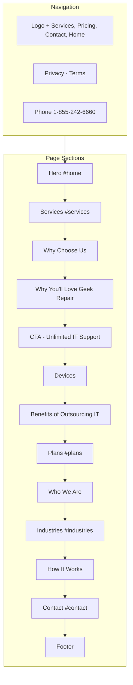
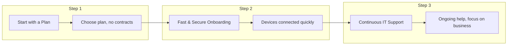
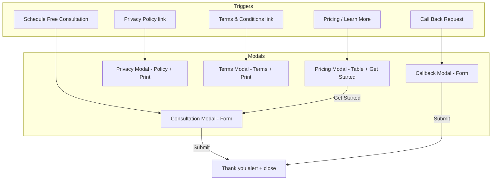
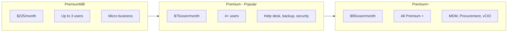
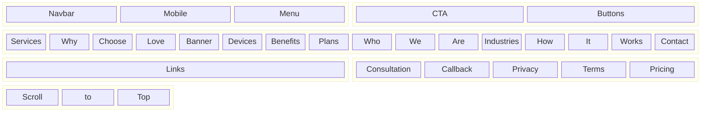
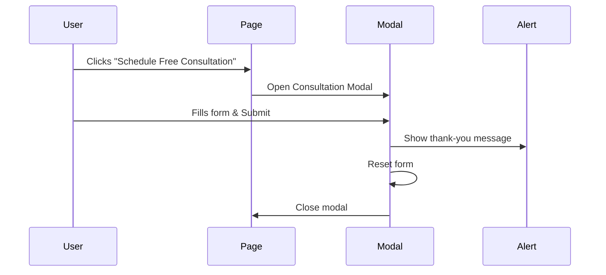

# Geek Repair – Complete IT Support Website

**Geek Repair** is a single-page marketing website for **Complete IT Support for Small to Medium Organizations**. It showcases services, pricing plans, industries served, and contact options with a modern dark theme and orange accent.

---

## Table of Contents

- [Overview](#overview)
- [Tech Stack](#tech-stack)
- [Project Structure](#project-structure)
- [Features & Work Done (Start to End)](#features--work-done-start-to-end)
- [Responsive & Mobile](#18-responsive--mobile)
- [Flowcharts & Diagrams](#flowcharts--diagrams)
- [How to Run](#how-to-run)
- [Contact & Legal](#contact--legal)

---

## Overview

| Item | Description |
|------|-------------|
| **Project** | Geek Repair – IT Support & Repair Services |
| **Type** | Single-page website (HTML + Tailwind + vanilla JS) |
| **Target** | Small to medium organizations, 20+ industries, nationwide (US) |
| **Theme** | Dark background, primary orange (`#f97316`), gradients, premium UI |

---

## Tech Stack

| Technology | Use |
|------------|-----|
| **HTML5** | Structure, semantics, accessibility |
| **Tailwind CSS** (CDN) | Layout, spacing, colors, responsive design |
| **Custom CSS** | Gradients, cards, modals, journey tree, scroll progress |
| **Vanilla JavaScript** | Modals, mobile menu, form submit, scroll-to-top, print |
| **Remix Icon** (CDN) | Icons |
| **Google Fonts (Inter)** | Typography |
| **Images** | Local assets in `assest/` (1.png–8.png) |

---

## Project Structure

```
geekrepair-main/
├── index.html          # Single page – all sections and modals
├── assest/             # Images
│   ├── 1.png           # Hero main image
│   ├── 2.png, 3.png    # Hero grid images
│   ├── 4.png           # Why Choose Us banner
│   ├── 5.png           # Devices section
│   ├── 6.png, 7.png    # Benefits section
│   └── 8.png           # Industries parallax background
└── README.md           # This file
```

---

## Features & Work Done (Start to End)

### 1. Navigation & Header

- **Fixed navbar** with logo, links (Services, Pricing, Contact, Home), Privacy Policy, Terms & Conditions.
- **Phone CTA**: `1-855-242-6660` (desktop + mobile).
- **Mobile menu**: Hamburger toggle (works on both **touch and click**), full-width dropdown with same links + “Free Schedule” button. Menu is scrollable on small screens (`max-height` + overflow). Toggle uses `type="button"`, `touch-action: manipulation`, and proper `aria-expanded` / `aria-controls` for accessibility. Menu closes when a link or “Free Schedule” is clicked.
- **Smooth scroll** for in-page anchors.

### 2. Hero Section (`#home`)

- Headline: *Complete IT Support for Small to Medium Organizations*.
- Subtext and badge “IT Support That Scales”.
- **CTAs**: “Schedule Free Consultation”, “Learn More”.
- **Hero image grid**: 3 images (assest/1.png, 2.png, 3.png) with gradient overlay and “IT Support” badge.
- Gradient background and orange glow.

### 3. Services Section (`#services`)

- **14 service cards** (hover effects, orange border, icons):
  - Laptop & Desktop  
  - WiFi – LAN Installation  
  - Printer Installation  
  - Smart Phones  
  - Camera  
  - Tablets  
  - TV Mounting  
  - Game Console  
  - Home Appliance  
  - Data Recovery  
  - Virus & Malware Removal  
  - Small Appliances  

### 4. Why Choose Us

- **Banner image** (assest/4.png) with overlay and “24/7 Available” badge.
- **3 cards**: 24/7 Support, Top Guide, Advanced Troubleshooting (numbered 01–03, hover effects).
- **“Ask Us Anything” CTA** with “See More” to Contact.

### 5. Why You’ll Love Geek Repair

- Full-width **background image** (Unsplash) with dark overlay.
- **3 love cards**: Experienced & Verified Technicians, Service tailored to you, Save valuable time at home.
- Card icons and hover states.

### 6. CTA Banner – Unlimited IT Support

- **$75/user/month** (min 3 users).
- Badges: 24/7 Helpdesk, Remote + Onsite, Certified Techs.
- **“Schedule FREE consultation”** button opening consultation modal.

### 7. Devices Section (Comprehensive Technical Support for Every Device)

- **Device coverage** list: Wi‑Fi, Printers, Laptops, PC/Mac, Tablets, iOS/Android, Network Setup, Servers, Cloud, Storage, Security Cameras, Scanners, Projectors, Peripherals.
- **Image** (assest/5.png) and device cards with icons (Remix Icon).
- **Overlap scroll**: This section and “Benefits of Outsourcing” sit inside an **overlap-scroll wrapper**. On **mobile and desktop**, the heading is sticky; the first panel (Devices) sticks while the second panel (Benefits) overlaps on scroll.
- **Mobile order**: On small screens, the image appears **first**, then the device cards and text below.

### 8. Benefits of Outsourcing IT

- **6 benefit cards**: Dedicated IT Team, Modern Technology, Service Automation, Quick Remote Response, Flat Pricing, Safe & Secure.
- **Two overlapping images** (assest/6.png, 7.png) with labels “Dedicated Team”, “Secure & Scalable”.
- “Business-grade protection” strip below images.
- **Overlap scroll**: On mobile and desktop, this section overlaps the “Comprehensive Technical Support” section (second panel in the same wrapper).

### 9. Plans Section (`#plans`)

- **Three plans**:
  - **PremiumMB**: $225/month, up to 3 users (micro business).
  - **Premium** (Most Popular): $75/month per person, 4+ users – help desk, remote/onsite, backups, monitoring, security.
  - **Premium+**: $95/month per person – all Premium + MDM, Procurement, Data Compliance, Virtual CIO (4+ seats).
- “Learn More About Pricing” links to **Pricing modal**.

### 10. Who We Are

- Short **about** text: repair/service scope (Computers, Tablets, Phones, Printers, Wi‑Fi, TV, Gaming, Cameras, Smart Home, Appliances, etc.) and commitment to fast service, appointments, protection plans.

### 11. Industries Section (`#industries`)

- **Parallax background** (assest/8.png).
- “Trusted IT Support Across 20+ Industries & All 50 States”.
- **8 industry chips**: Accounting & Business Services, Advisory & Financial, Lawyers & Law Firms, Marketing & Advertising, Real Estate, Construction, Freelancers & Consultants, Medical & Dental.
- CTA: “See how GeekSupport can help your business”.
- **Overlap scroll**: This section and “How It Works” sit in a second **overlap-scroll wrapper**. On **mobile and desktop**, the Industries panel sticks and “How It Works” overlaps on scroll.

### 12. How It Works (Journey Tree)

- **3-step journey** with wave SVG and numbered nodes:
  1. **Start with a Plan** – Choose plan, no contracts.
  2. **Fast & Secure Onboarding** – Devices connected quickly.
  3. **Continuous IT Support** – Ongoing help.
- Alternating left/right cards on desktop; vertical timeline on mobile.

### 13. Contact Section (`#contact`)

- **Form**: First Name, Last Name, Email, Phone, Company Name, Company Size, Service Interest, Message.
- **Contact blocks**: Quick Connect (phone 1-855-242-6660), Email (support@geeksupportllc.com), Business Hours (Mon–Sat 8–6, Sun closed), Office Address (4307 Vineland Rd, Suite H-12, Orlando, FL 32811).
- Submit shows thank-you alert (form reset).

### 14. Footer

- **Top strip**: “Ready to get started?” with “Schedule Free Consultation” and “Call Now”.
- **Footer body**: Logo, short tagline, trust badges (24/7, US, Secure), Navigate (Home, Services, Pricing, Plans, Contact), Legal (Privacy, Terms), Get in touch (phone, email, address).
- **Copyright**: © 2025 Geek Repair. “Back to top” link.

### 15. Modals

| Modal | Trigger | Content |
|-------|--------|--------|
| **Consultation** | “Schedule Free Consultation”, “Free Schedule”, “Schedule FREE consultation” | Same fields as contact form (name, email, phone, company, size, interest, message). Submit → thank-you + close. |
| **Callback** | (if linked in nav/menu) | Name, Phone, Email, Issues Message. Submit → thank-you + close. |
| **Privacy Policy** | “Privacy Policy” in nav/footer | Full privacy policy text. Print button (opens print/PDF dialog). |
| **Terms & Conditions** | “Terms & Conditions” in nav/footer | Full terms text. Print button. |
| **Pricing** | “Pricing” in nav/footer, “Learn More” on plans | Comparison table: GeekPremiumMB ($225), GeekPremium ($75/person), GeekPremium+ ($95/person). “Get Started” opens Consultation modal. |

- All modals: backdrop click and Escape close; body scroll locked when open.

### 16. Scroll to Top

- **Floating button** (bottom-right) with circular progress ring showing scroll progress.
- Click scrolls to top smoothly.
- Gradient stroke (yellow–orange) on ring.

### 17. UX & Accessibility

- Smooth scroll, focus states, `aria-hidden` / `aria-modal` / `role="dialog"` on modals.
- Semantic sections and headings.
- Responsive breakpoints (mobile, tablet, desktop) for layout and nav.

### 18. Responsive & Mobile

- **Mobile menu**: Toggle works on touch and click; 44px min touch target; `touch-action: manipulation` to reduce tap delay; menu closes on link/schedule click.
- **Sections**: All sections use responsive spacing and typography (e.g. hero `text-3xl` → `lg:text-6xl`). CTA banner and hero padding scale for small screens. Nav and body use `overflow-x: hidden` to avoid horizontal scroll.
- **Overlap sections (mobile)**:
  - **Devices + Benefits**: “Comprehensive Technical Support for Every Device” and “Benefits of Outsourcing Your IT Support” both show in the **overlap** (sticky heading, first panel sticky, second panel overlaps).
  - **Industries + How It Works**: “Trusted IT Support Across 20+ Industries & All 50 States” and “How It Works” both show in the **overlap** (same sticky/overlap behavior).
- **Pricing table** (in Pricing modal): Horizontal scroll on small screens (`overflow-x: auto`, touch scrolling). Images use `max-width: 100%` to prevent overflow.

---

## Flowcharts & Diagrams

### 1. Website Section Flow (Top to Bottom)



### 2. User Journey (How It Works)



### 3. Modal & CTA Flow



### 4. Plans & Pricing Overview



### 5. Component / Section Architecture



### 6. Data Flow – Contact & Consultation



---

## How to Run

1. **Local**
   - Open `index.html` in a browser (double-click or drag into browser).
   - Or use a simple local server, e.g.:
     - `npx serve .`
     - `python -m http.server 8000` (then open `http://localhost:8000`).

2. **Assets**
   - Ensure `assest/` folder is in the same directory as `index.html` (1.png–8.png).
   - External: Tailwind and Remix Icon from CDN; page works with internet for fonts/CDN.

3. **No build step** – plain HTML/CSS/JS.

---

## Contact & Legal

| | |
|--|--|
| **Phone** | 1-855-242-6660 (24/7) |
| **Email** | support@geeksupportllc.com |
| **Address** | 4307 Vineland Rd, Suite H-12, Orlando, FL 32811 |
| **Hours** | Mon–Sat 8:00 AM – 6:00 PM; Sunday closed |

- **Privacy Policy** and **Terms & Conditions** are available in modals (nav/footer) and can be printed/saved as PDF from the modal print action.
- © 2025 Geek Repair. All rights reserved.

---

## Summary

This project is a **single-page marketing site** for Geek Repair IT support. It includes **navigation, hero, 14 services, multiple “why us” and benefits sections, device coverage (with overlap scroll), three pricing plans, industries (with overlap scroll), a 3-step “How it works” journey, contact form, footer, and five modals** (consultation, callback, privacy, terms, pricing). **Mobile experience**: working hamburger menu (touch + click), responsive sections, overlap scroll for both “Devices + Benefits” and “Industries + How It Works,” image-first order in the Devices section on mobile, and scrollable pricing table in modals. The **flowcharts and diagrams** above describe the page flow, user journey, modal/CTA behavior, plans structure, and high-level architecture. All work from start to end is captured in the [Features & Work Done](#features--work-done-start-to-end) section.
